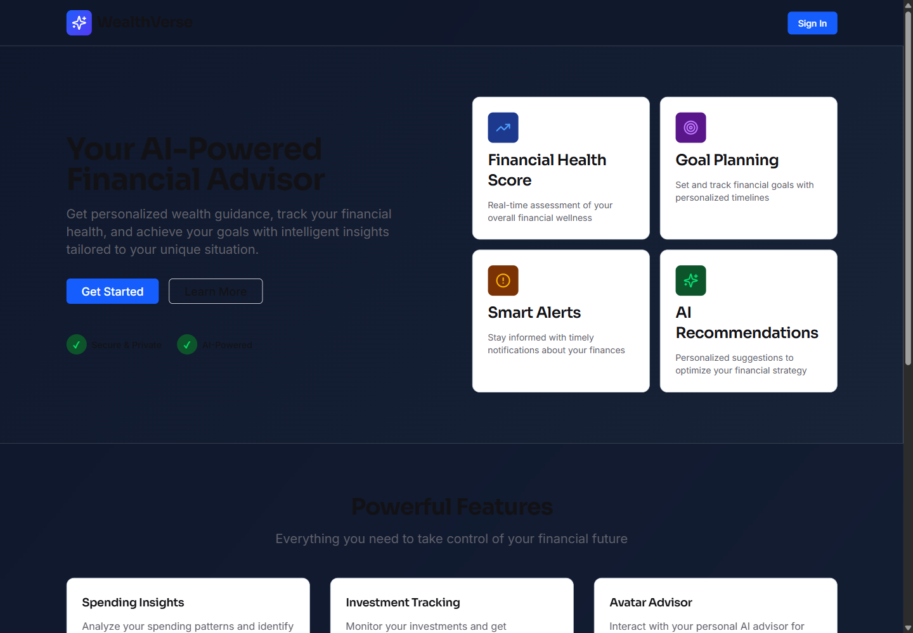
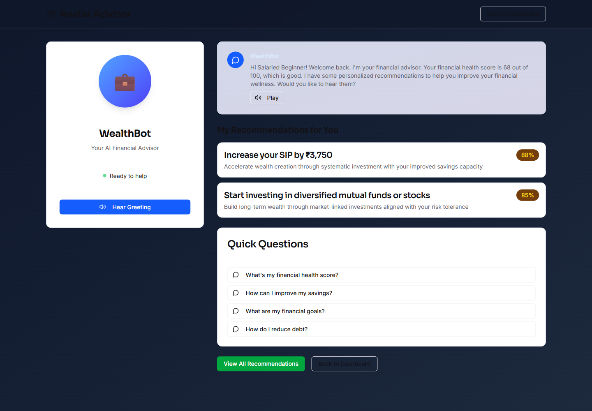

# WealthVerse

WealthVerse is an AI-powered digital wealth management prototype built for a hackathon demo. It provides a banking-app-style financial dashboard, demo user profiles, spending insights, goal planning, explainable recommendations, and a voice-enabled avatar advisor experience.

## Current Status

P0 stabilization is complete and verified.

The prototype now runs locally in demo mode without Manus OAuth or a database, passes TypeScript checks, passes the current test suite, builds successfully, and has been manually preview-tested in Chrome across the main pages.

## Screenshots

| Home | Dashboard |
|---|---|
|  |  |

| Spending | Goals |
|---|---|
|  |  |

| Recommendations | Avatar Advisor |
|---|---|
|  |  |

## Working Features

- Local demo login fallback without Manus OAuth.
- Demo financial profiles with synthetic financial data.
- Dashboard with financial health score, income, expenses, savings rate, score breakdown, recommendations, and achievements.
- Spending insights with category breakdown chart and savings opportunities.
- Goal planner with progress cards and goal summary.
- Explainable rule-based financial recommendations.
- Avatar Advisor page with browser speech synthesis.
- Protected tRPC API routes backed by database helpers or local demo fallback data.
- Production build through Vite and esbuild.

## Tech Stack

| Area | Technology |
|---|---|
| Frontend | React 19, Vite, TypeScript, Wouter, TanStack Query, tRPC React |
| UI | Tailwind CSS v4, Radix UI-style components, lucide-react, Recharts |
| Backend | Express, tRPC, TypeScript, tsx |
| Database | MySQL, Drizzle ORM |
| Auth | Manus OAuth/session template with local demo fallback |
| Testing | Vitest |
| Build | Vite, esbuild, pnpm |

## Folder Structure

```text
client/
  index.html
  src/
    App.tsx
    main.tsx
    pages/              Main WealthVerse screens
    components/         Layout, AI chat, and UI components
    contexts/           Theme context
    lib/                tRPC client and utilities

server/
  routers.ts            Main tRPC API router
  db.ts                 Database access and local demo fallback data
  financialEngine.ts    Financial health, insights, and recommendations logic
  seedDemoData.mjs      MySQL demo seed script
  _core/                Auth, server bootstrap, storage, LLM, and template helpers

drizzle/
  schema.ts             MySQL table schema
  *.sql                 Generated migrations

shared/
  const.ts              Shared constants
  types.ts              Shared types

docs/
  screenshots/          README screenshots
```

## Demo Mode

Demo mode is designed for local development and judging.

In development, WealthVerse defaults to demo mode unless `WEALTHVERSE_DEMO_MODE=false` is set. Demo mode provides:

- A local demo user.
- Built-in demo profiles.
- Built-in transactions, goals, alerts, badges, and savings streaks.
- Working protected routes without Manus OAuth.
- Working app data without `DATABASE_URL`.

For real database/OAuth usage, provide the required environment variables and disable demo mode if needed.

## Installation

1. Install Node.js.
2. Install pnpm, or use Corepack if available.
3. Install dependencies:

```bash
pnpm install
```

4. Start the local app:

```bash
pnpm dev
```

5. Open the printed local URL, usually:

```text
http://localhost:3000/
```

If port `3000` is busy, the server automatically selects another nearby port.

## Environment Variables

See [.env.example](.env.example).

| Variable | Required | Purpose |
|---|---:|---|
| `WEALTHVERSE_DEMO_MODE` | No | Enables local demo fallback. Defaults to enabled in development. |
| `DATABASE_URL` | No in demo mode, yes for real DB | MySQL connection URL. |
| `JWT_SECRET` | Required in production | Session JWT signing secret. |
| `VITE_OAUTH_PORTAL_URL` | Only for Manus OAuth | OAuth portal URL. |
| `VITE_APP_ID` | Only for Manus OAuth | Manus app/project ID. |
| `OAUTH_SERVER_URL` | Only for Manus OAuth | OAuth token/userinfo server. |
| `BUILT_IN_FORGE_API_URL` | Optional | Template services for storage/LLM/maps/voice helpers. |
| `BUILT_IN_FORGE_API_KEY` | Optional | API key for template services. |
| `OWNER_OPEN_ID` | Optional | Admin owner mapping. |

## Commands

```bash
pnpm install
pnpm dev
pnpm run check
pnpm test
pnpm run build
```

## Verification Status

The P0 verification pass completed with:

- TypeScript check: passing.
- Vitest suite: passing.
- Production build: passing.
- Chrome manual preview QA: passing for the main pages.

## Known Limitations

- The current AI/ML behavior is rule-based, not a full LLM advisor yet.
- Avatar Advisor uses browser speech synthesis and scripted text.
- Quick Questions do not yet generate real conversational answers.
- `Learn More` buttons on recommendations are placeholders.
- The UI is functional but not yet redesigned or polished.
- The demo data is synthetic and not connected to real banking APIs.
- Lending/lead generation flows are not implemented yet.
- Bundle size warning remains during production build.

## Future Roadmap

- Redesign the frontend experience with a more polished wealth-management UI.
- Add a real AI advisor endpoint using financial context.
- Add voice input and real conversational responses.
- Improve investment recommendation depth and risk explanations.
- Add bank-style account views, transaction history, and richer charts.
- Add responsible financial disclaimers.
- Add lending eligibility and consent-based lead capture.
- Expand automated test coverage for financial logic and API routes.
- Add deployment documentation for Render, Vercel, or similar platforms.
