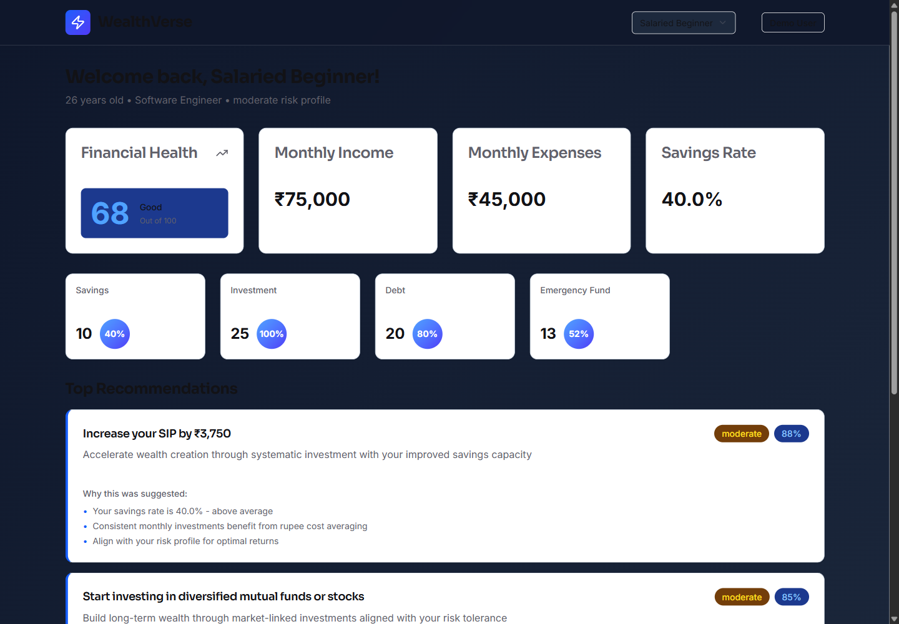
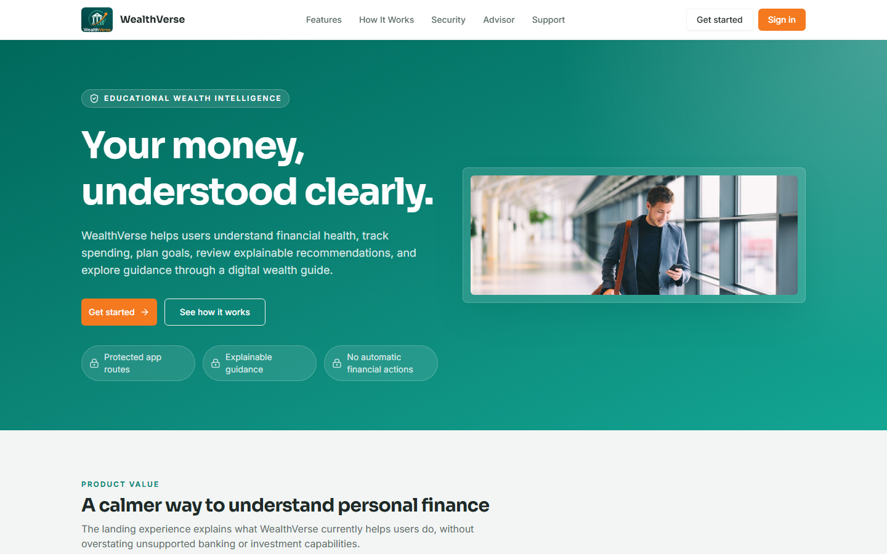
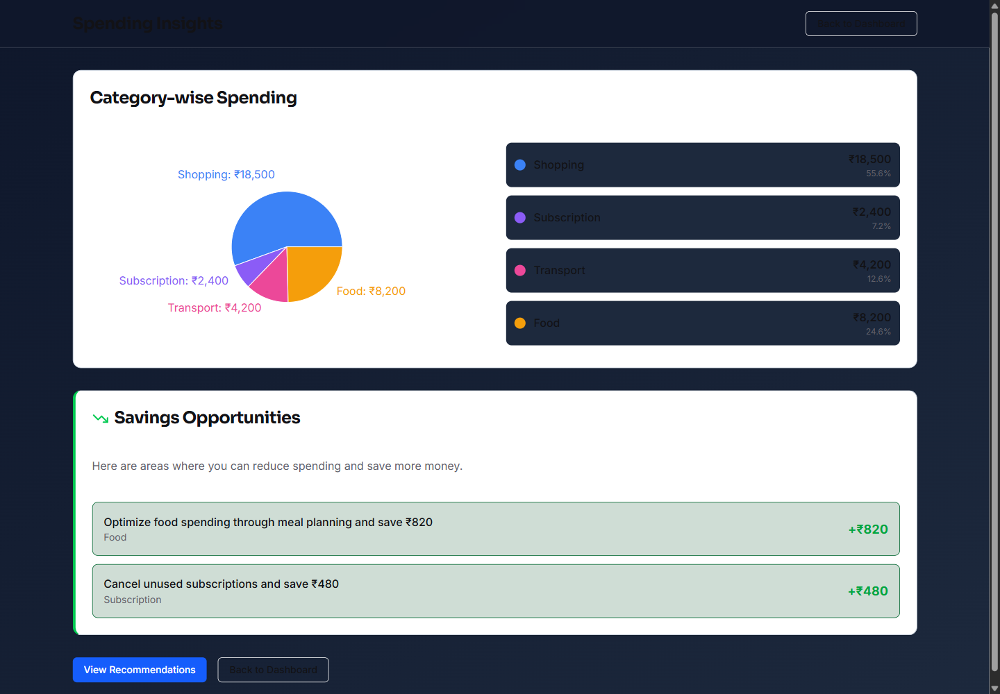
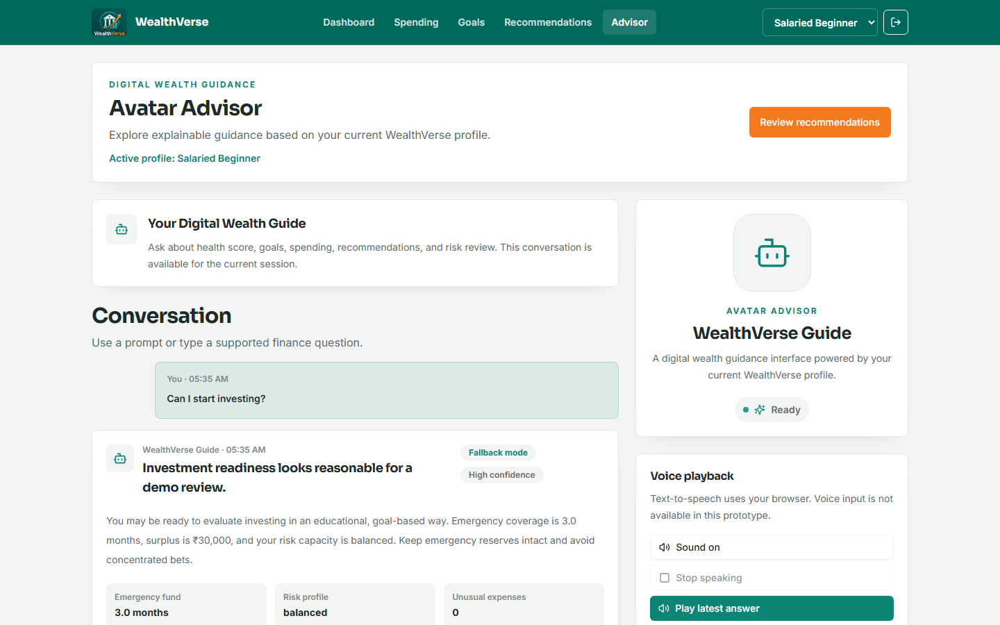
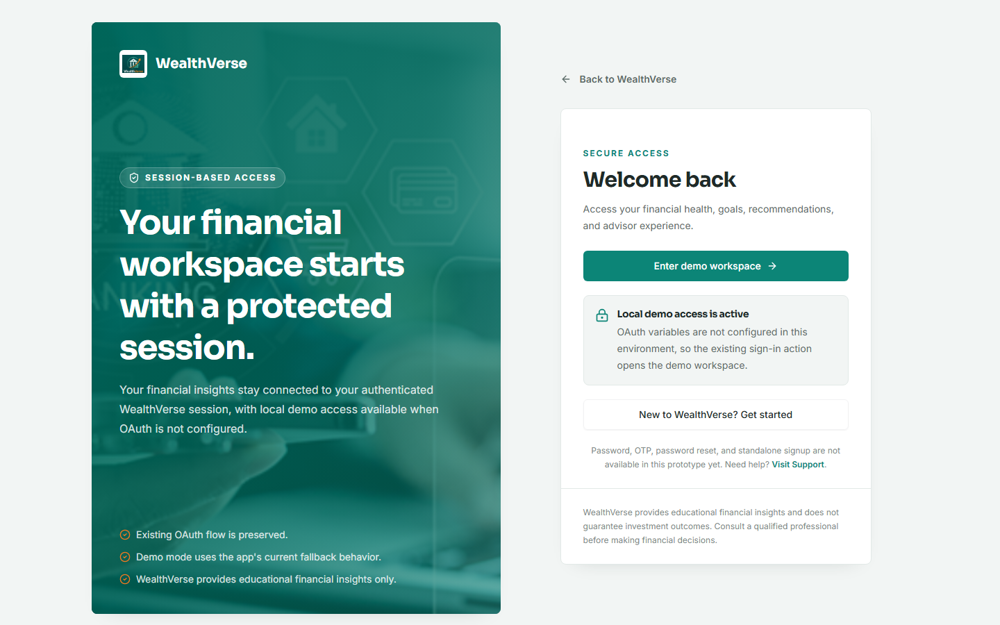
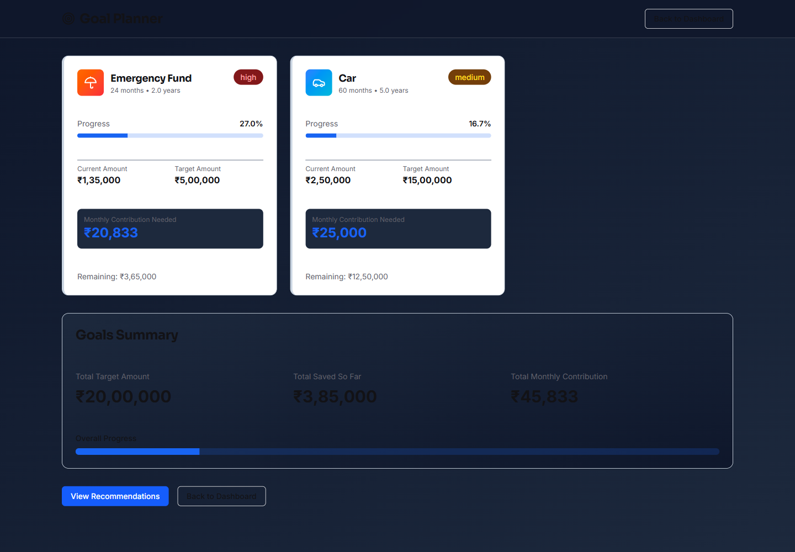
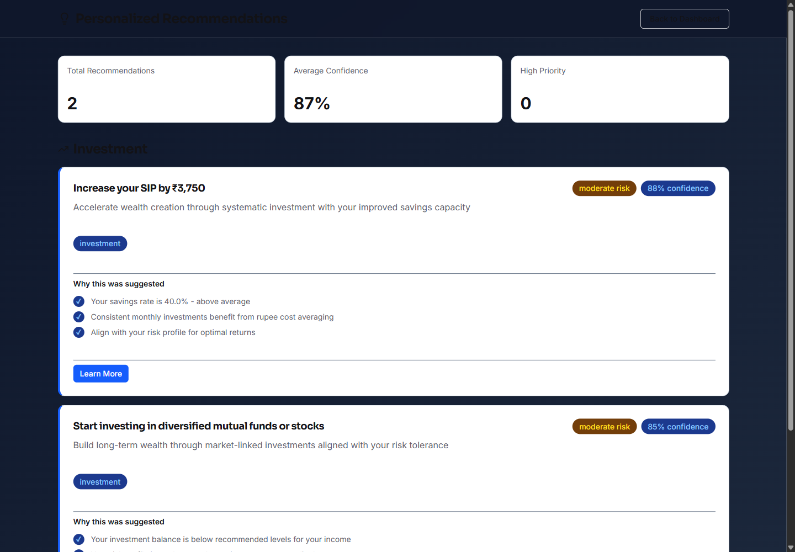
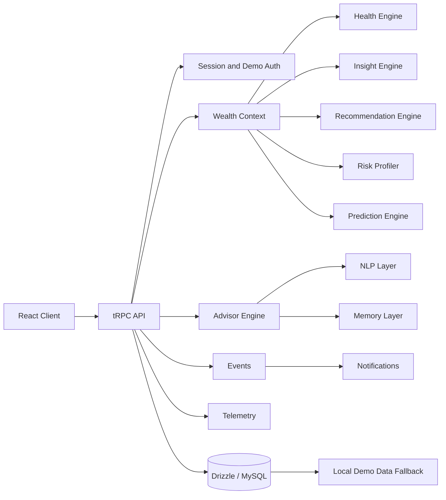

# WealthVerse

An explainable personal financial intelligence platform that turns profile, spending, goal, and risk signals into a clear health view, prioritized guidance, and profile-aware next actions.

WealthVerse is currently a hackathon-ready demo product. It runs locally with synthetic demo profiles, works without OAuth or a database in local demo mode, and keeps financial guidance educational and non-executing.

## Product Preview



| Public Experience | Product Workspace | Advisor |
|---|---|---|
|  |  |  |
|  |  |  |

Additional screenshots:

- [Signup](docs/screenshots/signup.png)
- [Persona Selection](docs/screenshots/persona-selection.png)
- [Building Wealth Context](docs/screenshots/building-wealth-context.png)
- [Support Centre](docs/screenshots/support.png)
- [Dashboard mobile](docs/screenshots/dashboard-mobile.png)
- [Avatar mobile](docs/screenshots/avatar-mobile.png)

## The Problem

People receive financial information across banking, spending, investment, credit, insurance, and goal-tracking surfaces, but still struggle to answer:

- Am I financially healthy?
- What needs attention first?
- Why is this recommendation relevant to me?
- What should I do next this month?

Most tools show charts without direction, generic advice without context, or reactive summaries after decisions are already made.

## The Solution

WealthVerse acts as a financial intelligence layer:

```text
Financial Profile
-> Wealth Context
-> Health Assessment
-> Spending Analysis
-> Goal Forecasts
-> Recommendations
-> Advisor Guidance
-> Clear Next Action
```

The product combines deterministic financial engines, explainable recommendations, lightweight NLP intent handling, predictions, notifications, and advisor responses into one banking-style workspace.

## Core Product Experience

- **Financial Dashboard**: health score, account overview, income, expenses, savings rate, risk profile, alerts, recommendations, goals, transactions, and monthly outlook.
- **Spending Insights**: category breakdown, unusual expenses, savings opportunities, recent transactions, and profile-aware summaries.
- **Goal Planner**: goal progress, contribution estimates, completion forecasts, priority signals, and empty states.
- **Explainable Recommendations**: grouped recommendations with priority, effort, expected impact, risk labels, reasoning, next action, and educational disclaimers.
- **Avatar Advisor**: conversation UI that calls the advisor route, supports suggested prompts, displays confidence/mode, offers browser text-to-speech, and keeps voice output optional.
- **Demo Profiles**: local synthetic profiles for reliable judging and walkthroughs.
- **Support Centre**: static FAQ, search/filtering, safety guidance, capability limits, and support disclaimers.

## Intelligence Architecture

Verified backend layers:

- **Wealth Context**: unified profile, cashflow, goals, recommendations, alerts, transactions, unusual expenses, opportunities, risk profile, and insights.
- **Financial Health Engine**: deterministic score components for savings, investment readiness, debt, and emergency fund coverage.
- **Insight Engine**: structured wins, warnings, opportunities, trends, goal signals, and risk signals.
- **Recommendation Engine**: explainable cashflow, savings, investment, debt, goal, risk, and habit recommendations.
- **Risk Profiler**: conservative, balanced, and growth profiles with constraints and suitable/unsuitable actions.
- **Advisor Engine**: profile-aware answers with summary, key insights, next actions, follow-up questions, metrics, confidence, mode, and disclaimer.
- **NLP Layer**: offline question normalization, synonym handling, entity extraction, intent classification, and context resolution.
- **Memory Layer**: in-memory rolling advisor history and preference profile.
- **Prediction Layer**: deterministic health, goal, spending, and monthly outlook forecasts.
- **Events and Notifications**: typed in-memory domain events, timeline mapping, notification rules, unread counts, and digest generation.
- **Telemetry**: internal operation timing, metrics, health, and timeline.
- **Persistence Boundary**: in-memory provider by default with optional local JSON provider for development.



## Does WealthVerse use an LLM?

**Classification: Optional LLM with deterministic fallback.**

The active frontend route is:

```text
client/src/pages/AvatarAdvisor.tsx
-> trpc.wealth.askAdvisor
-> server/routers.ts
-> answerWealthAdvisorQuestion()
-> server/wealth/advisorEngine.ts
```

By default, WealthVerse does **not** require a live external LLM. If `BUILT_IN_FORGE_API_KEY` is not configured, the advisor returns deterministic fallback responses generated from:

- NLP intent classification
- WealthContext
- insights
- recommendations
- alerts
- risk profile
- predictions
- memory and preferences

If `BUILT_IN_FORGE_API_KEY` is configured, `answerWealthAdvisorQuestion()` can call the Forge-compatible chat completions helper in `server/_core/llm.ts` using model `gpt-4o-mini`. The call asks for a JSON advisor response and falls back to the deterministic response if the upstream request fails or returns invalid content.

This makes the demo reliable without API keys while leaving a guarded path for later LLM-backed responses.

## Technology Stack

### Frontend

- React 19
- TypeScript
- Vite
- Tailwind CSS v4
- shadcn/Radix-style components
- Wouter
- TanStack Query
- tRPC React
- Recharts
- lucide-react

### Backend

- Node.js
- Express
- tRPC
- Zod
- TypeScript
- Drizzle ORM
- MySQL-ready data access

### Testing and Build

- Vitest
- `tsc --noEmit`
- Vite production build
- esbuild server bundle
- pnpm

## Repository Structure

```text
client/
  src/pages/                 Public and product pages
  src/components/            Layout, auth, wealth, spending, goals, recommendations, advisor, support, and UI components
  src/assets/wealthverse/    Approved visual assets
  src/lib/                   tRPC client, formatters, utilities

server/
  routers.ts                 Main tRPC API
  db.ts                      Database access and local demo fallback data
  financialEngine.ts         Health score and legacy recommendation compatibility
  wealth/                    Intelligence, NLP, memory, predictions, events, notifications, persistence, telemetry
  _core/                     Auth, env, logging, server bootstrap, storage, LLM helper, system routes

drizzle/
  schema.ts                  MySQL schema
  relations.ts               Drizzle relations
  *.sql                      Migrations

shared/
  const.ts                   Shared constants
  types.ts                   Shared types

docs/screenshots/
  *.png                      README product screenshots
```

## Getting Started

```bash
git clone https://github.com/mohammedsuhailrafek28/wealth-verse.git
cd wealth-verse
pnpm install
cp .env.example .env
pnpm dev
```

Open the local URL printed by the server, usually:

```text
http://localhost:3000/
```

If port `3000` is busy, the server automatically selects another nearby port.

## Environment Variables

See [.env.example](.env.example). Do not commit real `.env` files.

| Variable | Required | Purpose |
|---|---|---|
| `WEALTHVERSE_DEMO_MODE` | No | Enables local demo fallback. Defaults to enabled in development unless set to `false`. |
| `WEALTHVERSE_ALLOW_DEMO_IN_PRODUCTION` | Production only if needed | Explicit guard for production demo mode. |
| `WEALTHVERSE_PERSISTENCE` | No | `memory` by default. `json` enables local dev JSON persistence under `.runtime/wealthverse-data/`. |
| `WEALTHVERSE_LOG_LEVEL` | No | Set to `debug` for local diagnostics. |
| `DATABASE_URL` | Required outside demo mode | MySQL connection URL. |
| `JWT_SECRET` | Required in production | Session JWT signing secret. |
| `VITE_OAUTH_PORTAL_URL` | OAuth only | OAuth portal URL. |
| `VITE_APP_ID` | OAuth only | App/project ID for OAuth. |
| `OAUTH_SERVER_URL` | OAuth only | OAuth token and userinfo server. |
| `BUILT_IN_FORGE_API_URL` | Optional | Forge-compatible helper API base URL. |
| `BUILT_IN_FORGE_API_KEY` | Optional | Enables optional LLM/helper calls. Omit for deterministic fallback mode. |
| `VITE_FRONTEND_FORGE_API_URL` | Optional | Frontend helper API base URL for optional map/proxy components. |
| `VITE_FRONTEND_FORGE_API_KEY` | Optional | Frontend helper API key for optional components. |
| `OWNER_OPEN_ID` | Optional | Admin owner mapping. |

## Demo Mode

Demo mode is designed for local development and hackathon judging.

In development, WealthVerse defaults to demo mode unless:

```bash
WEALTHVERSE_DEMO_MODE=false
```

Demo mode provides:

- a local demo user
- synthetic demo profiles
- transactions, goals, alerts, badges, and streaks
- protected product routes without OAuth
- data access without `DATABASE_URL`
- deterministic advisor responses without LLM keys

Recommended judge/demo flow:

```text
Landing -> Choose Persona -> Building Wealth Context -> Dashboard
```

Production guardrail: demo mode is blocked in production unless `WEALTHVERSE_ALLOW_DEMO_IN_PRODUCTION=true` is explicitly set.

## Available Scripts

```bash
pnpm install
pnpm dev
pnpm run check
pnpm test
pnpm run build
pnpm run db:push
```

## Routes

Public routes:

- `/`
- `/login`
- `/signup`
- `/support`
- `/choose-profile`
- `/building-context`

Product routes:

- `/dashboard`
- `/spending`
- `/goals`
- `/recommendations`
- `/avatar`

## API Surface

Important tRPC routers include:

- `auth.me`, `auth.logout`
- `profiles.list`, `profiles.getActive`, `profiles.setActive`
- `dashboard.getSummary`
- `spending.getBreakdown`, `spending.getUnusual`, `spending.getOpportunities`
- `goals.list`
- `recommendations.list`
- `alerts.list`
- `transactions.recent`, `transactions.summary`
- `wealth.getContext`, `wealth.getInsights`, `wealth.getRiskProfile`
- `wealth.askAdvisor`, `advisor.ask`
- `wealth.getPredictions`, `wealth.getMonthlyOutlook`
- `wealth.getEvents`, `wealth.getEventTimeline`
- `wealth.getNotifications`, `wealth.getUnreadNotificationCount`, `wealth.getNotificationDigest`
- `wealth.getMemory`, `wealth.clearMemory`, `wealth.getPreferences`, `wealth.updatePreferences`
- `wealth.getTelemetryMetrics`, `wealth.getTelemetryHealth`, `wealth.getTelemetryTimeline`
- `wealth.getPersistenceHealth`, `wealth.getSystemHealth`
- `system.health`

## Testing Status

Current verified status:

- TypeScript check: passing
- Vitest: 10 test files, 69 tests passing
- Production build: passing

## Current Limitations

- Demo data is synthetic and not connected to real banking APIs.
- WealthVerse does not move money, execute investments, open accounts, or submit loan leads.
- Account aggregation is not implemented.
- Goal creation/edit/delete mutations are not implemented.
- Recommendation save/apply/dismiss actions are not implemented.
- Speech-to-text is not implemented; Avatar Advisor uses browser text-to-speech only.
- In-memory memory/events/notifications/telemetry reset on server restart unless local JSON persistence is explicitly enabled.
- JSON persistence is local/dev only, not production storage.
- Optional LLM use requires `BUILT_IN_FORGE_API_KEY`; deterministic fallback is the default.
- Production legal, privacy, security, and regulatory review are required before real user deployment.

## Safety Disclaimer

WealthVerse provides educational financial insights only. It is not a substitute for qualified financial, legal, tax, or investment advice. It does not guarantee financial or investment outcomes.

## Roadmap

- Real account aggregation with explicit consent
- Persistent database mapping for memory, events, notifications, and telemetry
- Goal creation and contribution planning workflows
- Recommendation save, dismiss, and action tracking
- Persistent advisor conversations
- Speech input
- Scenario planning and richer forecasting
- Production legal, privacy, accessibility, and security hardening
